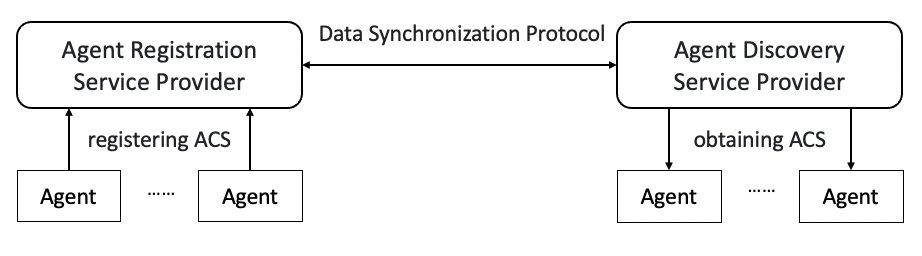

[Home](../README_en.md)

**[English](ACPs-spec-ACS_en.md) | [中文](ACPs-spec-ACS.md)**

ACS: Agent Capability Specification (ACPs-spec-ACS-v02.02)

# 1. Document Definition

This document is the specification definition of the Agent Capability Specification (ACS) within the ACPs agent collaboration protocol system that supports agent interconnection, version v02.02.

The full title of the document is ACPs-spec-ACS-v02.02.

Document authors: Ke Yu (Beijing University of Posts and Telecommunications), Jun Liu (Beijing University of Posts and Telecommunications), Ke Li (Beijing University of Posts and Telecommunications), Xiaolian Guo (Beijing University of Posts and Telecommunications), Yinming Li (Beijing University of Posts and Telecommunications), Haozhe Song (Beijing University of Posts and Telecommunications), Xiaofeng Hu (Beijing University of Posts and Telecommunications), Di Ma (Beijing University of Posts and Telecommunications), Keliang Chen (Beijing University of Posts and Telecommunications).

# 2. Introduction to Agent Capability Specification and Related Processes

For agent interconnection to become a secure and reliable agent system, an important capability that must be provided is support for an agent to describe its own capabilities, for such descriptions to be stored, and for other agents' descriptions of their own capabilities to be retrieved. The manner of agent capability description must ensure a certain degree of standardization to facilitate interconnection and interoperation among agents, and must also possess a certain degree of flexibility to accommodate the complex capability expressions of agents based on large models. To achieve the above goals, we define the Agent Capability Specification (ACS) in this document.

Each agent should generate an ACS for itself and register it with an Agent Registration Service Provider (ARSP). The Agent Registration Service Provider may synchronize the ACS registered by the agent, through the Data Synchronization Protocol (DSP), to an Agent Discovery Service Provider (ADSP), which provides it to other agents to support agent capability queries. The process by which an agent registers and obtains an ACS is shown in the figure below.



Note: In addition to obtaining the ACS through the Agent Discovery Service Provider as described above, an agent may also place its own ACS file under its own service access address, supporting direct retrieval by other users in a Well Known manner, for example `https://agent.example.com/.well-known/acs.json`. It should be particularly pointed out, however, that it is an insecure manner for a user to obtain an agent capability description in this way; we rather recommend obtaining the ACS through the Agent Discovery Service Provider to ensure that it is secure and reliable.

# 3. Agent Capability Specification Definition

The Agent Capability Specification (ACS) definition of ACPs is expressed in JSON format, and the definition format is as follows:

## 3.1. AgentCapabilitySpec Core Object

```typescript
/**
 * The root object of the Agent Capability Specification.
 * This is the core data structure of the ACS (Agent Capability Specification),
 * fully describing the agent's identity information, functional capabilities, technical characteristics, and service interfaces.
 * It is used for the registration, discovery, matching, and collaboration of agents.
 */

export interface AgentCapabilitySpec {
  /**
   * The agent's unique identity identifier, assigned by the registration service.
   *
   * @TJS-examples ["1.2.156.3088.1.34C2.478BDF.3GF546.1.0SEN"]
   */
  aic: string;

  /**
   * The activation status of the agent, maintained by the registration service.
   *
   * @TJS-examples [true, false]
   */
  active: boolean;

  /**
   * The last modification time of the agent capability description, provided by the registration service.
   * It uses the ISO 8601 format and includes time zone offset information; Beijing time (UTC+8) is recommended.
   *
   * @TJS-examples ["2025-03-15T16:30:00+08:00"]
   */
  lastModifiedTime: string;

  /**
   * The ACPs protocol version supported by this agent, used for protocol compatibility checking and version matching.
   *
   * @TJS-examples ["02.02"]
   */
  protocolVersion: string;

  /**
   * The name of this agent, concisely describing the agent's main function.
   *
   * @TJS-examples ["Beijing Urban Area Travel Planning Assistant", "Beijing Suburban Attraction Recommendation Agent", "Cultural Tour Guide Expert"]
   */
  name: string;

  /**
   * A detailed description of this agent, helping users and other agents understand its purpose and limitations.
   * It should clearly state what the agent can and cannot do, including limitations such as geographic scope and service types.
   *
   * @TJS-examples ["Planning and advice for travel in the Beijing urban area. Only responsible for the six central districts, not the suburbs. An agent for exploring and planning tourist attractions in the Beijing urban area, specifically responsible for tourist attraction recommendation and itinerary planning in the six central districts of Beijing (Dongcheng/Xicheng/Chaoyang/Haidian/Fengtai/Shijingshan). It refuses requests beyond the urban area.", "Focused on tourist attraction recommendation and natural route planning in the Beijing suburbs (Miyun/Huairou/Yanqing/Changping/Mentougou/Fangshan/Daxing/Shunyi/Pinggu/Tongzhou). It refuses requests within the urban area."]
   */
  description: string;

  /**
   * The version number of the agent; the agent provider defines the format itself.
   * Following the Semantic Versioning specification is recommended.
   * Format: MAJOR.MINOR.PATCH; increment the MAJOR version when the API is incompatible.
   *
   * @TJS-examples ["1.0.0", "2.1.3", "1.2.0-beta.1"]
   */
  version: string;

  /**
   * The URL address of the agent icon, used to display the agent identifier in the user interface.
   *
   * @TJS-examples ["https://example.com/icons/beijing-agent.png", "https://cdn.example.com/agents/tour-guide.svg"]
   */
  iconUrl?: string;

  /**
   * The URL address of the agent's detailed documentation, providing usage instructions and API documentation.
   *
   * @TJS-examples ["https://docs.example.com/agents/beijing-tour", "https://github.example.com/org/agent/blob/main/README.md"]
   */
  documentationUrl?: string;

  /**
   * The URL of the web application that presents the agent's capabilities; users can experience the agent's functions through this address.
   *
   * @TJS-examples ["https://demo.example.com/beijing-tour", "https://app.example.com/agents/tour-guide"]
   */
  webAppUrl?: string;

  /**
   * Detailed information about the agent service provider, including organization, contact information, and so on.
   *
   * @TJS-examples [{"organization": "Beijing University of Posts and Telecommunications", "url": "https://ai.bupt.edu.cn", "license": "Beijing ICP Filing No. 140xxxxx-1"}]
   */
  provider: AgentProvider;

  /**
   * Declaration of the available security schemes used to authorize requests. The key is the scheme name, and the value is the corresponding security scheme configuration.
   * It follows the OpenAPI 3.0 security scheme object specification. An agent may declare support for multiple security schemes,
   * and selects the appropriate authentication method according to the security configuration of the endpoint at actual invocation time.
   *
   * This field is usually not empty.
   * An agent acting as a Partner usually provides services externally as the server side of mutualTLS, so the corresponding security scheme needs to be defined.
   * An agent acting as a Leader usually connects to other Partner agents as the client side of mutualTLS, so the corresponding security scheme also needs to be defined.
   *
   * Currently supported schemes include:
   * - mutualTLS: Mutual TLS authentication, suitable for high-security-level communication between agents
   * - openIdConnect: OpenID Connect authentication, suitable for user identity verification scenarios
   * - apiKey: API key authentication, suitable for simple service authentication scenarios
   * - http: HTTP authentication schemes, suitable for Basic/Bearer and other authentication scenarios
   * - oauth2: OAuth2 authentication, suitable for standard authorization flow scenarios
   *
   * @TJS-examples [
   *   {
   *     "mtls": {
   *       "type": "mutualTLS",
   *       "description": "mTLS mutual authentication between agents"
   *     },
   *     "oidc": {
   *       "type": "openIdConnect",
   *       "description": "User identity authentication",
   *       "openIdConnectUrl": "https://auth.example.com/.well-known/openid-configuration"
   *     }
   *   }
   * ]
   */
  securitySchemes: { [scheme: string]: SecurityScheme };

  /**
   * The list of agent endpoint configurations, defining the service endpoint information that the agent can access.
   * Each endpoint includes a URL, a transport protocol, and security requirements.
   * Multiple endpoints should support the same business functions with different protocols and authentication methods, to meet diverse access requirements.
   *
   * If the agent does not provide service endpoints for other agents to use, and is usually an assistant-type agent oriented to end users, then:
   * - This field is an empty array.
   *
   * If it serves as an agent ontology (Ontology), then, because an ontology does not directly provide service endpoints:
   * - This field is an empty array,
   *
   * If it serves as a derived agent entity (Entity), then:
   * - If service endpoints need to be provided externally, this field should contain the corresponding endpoint configurations.
   * - If service endpoints are not provided externally, this field is an empty array.
   *
   * @TJS-examples [[{"url": "https://api.example.com/acps-v2", "transport": "JSONRPC", "security": [{"mtls": []}]}]]
   */
  endPoints: AgentEndPoint[];

  /**
   * The declaration of optional capabilities supported by the agent, such as streaming responses, asynchronous notifications, and message queues.
   *
   * @TJS-examples [{"streaming": true, "notification": false, "messageQueue": ["mqtt:5.*", "kafka:>=2.8 <4.0"]}, {"streaming": false, "notification": true, "messageQueue": []}]
   */
  capabilities: AgentCapabilities;

  /**
   * The set of default supported input MIME types for all skills, which can be overridden on a per-skill basis.
   * It defines the input data formats that the agent can accept.
   *
   * @TJS-examples [["text/plain", "application/json"], ["text/plain", "image/jpeg", "audio/wav"]]
   */
  defaultInputModes: string[];

  /**
   * The set of default supported output MIME types for all skills, which can be overridden on a per-skill basis.
   * It defines the output data formats that the agent can generate.
   *
   * @TJS-examples [["text/plain", "application/json"], ["text/markdown", "application/json", "image/png"]]
   */
  defaultOutputModes: string[];

  /**
   * The set of skills or unique capabilities that the agent can perform; each skill represents a specialized functional module.
   *
   * If this field is an empty array, it indicates that this agent has not defined any skills. Such an agent is usually an assistant-type agent oriented to end users.
   *
   * @TJS-examples [[{"id": "beijing-tour/sight-recommender", "name": "Attraction Recommendation", "version": "1.0.0", "tags": ["travel", "Beijing"]}]]
   */
  skills: AgentSkill[];

  /**
   * The entity's user association ID. It is used to bind an agent entity to a specific user.
   * It is used for user assistant-type agents, identifying that the agent provides services for a specific user.
   */
  entityUserId?: string;
  /**
   * Additional metadata of the entity. The specific format and content are customized by the Agent Provider.
   *
   * If the Agent provides API services externally, it may supplement such information as the entity's geographic location and environment information.
   * If the Agent is a user assistant, it may supplement user-related data information.
   *
   * @TJS-examples [{"location": "Beijing", "environment": "production"}, {"userRelation": "personal-assistant"}]
   */
  entityMeta?: Record<string, any>;

  /**
   * Certificate-related configuration (optional).
   *
   * The certificate SAN entries and the requested validity period are unified under this field. The CA Server reads this field when issuing certificates.
   * Agents that do not need custom certificate parameters may omit it (the CA Server issues with default values).
   *
   * @TJS-examples [{"altNames": {"dns": ["mq.acps.example.com"], "ip": ["10.0.1.50"]}, "requestedValidity": 1825}]
   */
  certificate?: CertificateOptions;
}

/**
 * Certificate configuration options.
 */
export interface CertificateOptions {
  /**
   * Certificate Subject Alternative Names entries (optional).
   *
   * When the CA Server issues a certificate, by default it generates only URI:acps://{AIC}. The domain names and IP addresses
   * declared in this field are written into the certificate as additional DNS / IP SAN entries, for TLS hostname verification.
   *
   * Typical usage scenarios:
   * - Infrastructure services (such as RabbitMQ) need to provide TLS services externally under a deployment domain name/IP
   * - The Agent is deployed under its own domain name, and clients connect using that domain name
   *
   * Agents that do not provide TLS services externally may omit this field.
   *
   * During approval, the Registry Server verifies whether the domain names in dns are subdomains of domains already registered in
   * provider.domainRegistrations; ownership of IP addresses is manually confirmed by the approver.
   */
  altNames?: CertificateAltNames;

  /**
   * The requested certificate validity period (in days, optional).
   *
   * When unspecified, the CA Server default validity period is used (49 days, suitable for ordinary Agents).
   * When specified, it is confirmed through manual approval, and the CA Server issues the certificate with the approved number of days.
   * If it exceeds the maximum allowed value configured on the CA Server, the certificate is issued with the maximum allowed value.
   *
   * Typical usage scenario: infrastructure services (such as RabbitMQ) need a longer validity period to reduce rotation frequency.
   * Recommended reasonable range: 365 (1 year) to 1825 (5 years); exceeding 3650 (10 years) is not recommended.
   *
   * @TJS-examples [365, 1825]
   */
  requestedValidity?: number;
}

/**
 * Certificate Subject Alternative Names declaration.
 */
export interface CertificateAltNames {
  /**
   * The list of DNS domain names to be added to the certificate SAN (optional).
   * Each entry generates one x509 DNSName SAN. Wildcards are supported (such as `*.example.com`).
   *
   * @TJS-examples [["mq.acps.example.com", "*.acps.example.com"]]
   */
  dns?: string[];

  /**
   * The list of IP addresses to be added to the certificate SAN (optional, IPv4 or IPv6).
   * Each entry generates one x509 IPAddress SAN. It must be an exact single IP; CIDR is not supported.
   *
   * @TJS-examples [["192.168.1.100", "10.0.1.50"]]
   */
  ip?: string[];
}
```

## 3.2. AgentProvider Object

```typescript
/**
 * The agent service provider information object.
 * It defines the development and maintenance organization information of the agent, including organizational identity, contact information, and compliance qualifications.
 * It is used to establish trust relationships and provide technical support contact channels.
 */
export interface AgentProvider {
  /**
   * The country or region code of the agent provider. It conforms to the ISO 3166-1 alpha-2 standard.
   *
   * @default "CN"
   * @TJS-examples ["CN", "US", "GB"]
   */
  countryCode?: string;

  /**
   * The organization name of the agent provider, usually a top-level organization such as a company, university, or research institution.
   *
   * @TJS-examples ["Beijing University of Posts and Telecommunications"]
   */
  organization?: string;

  /**
   * The specific department or faculty name of the agent provider, providing more precise organizational structure information.
   *
   * @TJS-examples ["School of Artificial Intelligence"]
   */
  department?: string;

  /**
   * The URL address of the agent provider's official website or related documentation.
   *
   * @TJS-examples ["https://ai.bupt.edu.cn"]
   */
  url?: string;

  /**
   * The legal filing information or license number of the agent provider, used for compliance verification.
   * It is usually the ICP filing number of the website corresponding to the URL or other relevant qualification certificates.
   *
   * @TJS-examples ["Beijing ICP Filing No. 140xxxxx-1"]
   */
  license?: string;

  /**
   * The contact person's name of the agent provider, facilitating technical support and communication.
   * @TJS-examples ["Zhang San", "Li Si"]
   */
  name?: string;

  /**
   * The contact person's email address of the agent provider.
   *
   * @TJS-examples ["zhangsan@example.com", "lisi@example.com"]
   */
  email?: string;

  /**
   * The list of domain name registration and filing information of the agent provider.
   * It records the registration and filing information corresponding to each domain name used by the Provider, for verifying domain ownership during the review stage.
   * The domain names of all URLs in the ACS (endpoint, provider.url, documentationUrl, webAppUrl, etc.)
   * must be subdomains of, or identical to, one of the primary domain names in this list.
   *
   * @TJS-examples [[{"domain": "example.com", "registrationNumber": "Beijing ICP Filing No. 140xxxxx-1", "registrationType": "ICP"}]]
   */
  domainRegistrations?: DomainRegistration[];
}

/**
 * Domain name registration and filing information.
 */
export interface DomainRegistration {
  /**
   * The primary domain name / registered domain name (such as `example.com`), excluding protocol, path, and subdomain prefix.
   *
   * @TJS-examples ["example.com", "bupt.edu.cn"]
   */
  domain: string;

  /**
   * The filing number / registration number.
   * For the ICP type, it is the ICP filing number of a domain name within China (such as `Beijing ICP Filing No. 140xxxxx-1`).
   * For the WHOIS type, it is the registration information identifier of a WHOIS registration query.
   *
   * @TJS-examples ["Beijing ICP Filing No. 140xxxxx-1", "R-2024-00xxxxxx"]
   */
  registrationNumber: string;

  /**
   * The registration type.
   * ICP: ICP filing of a domain name within China.
   * WHOIS: WHOIS registration information query of an international domain name, covering all generic and country-code domain names.
   *
   * @TJS-examples ["ICP", "WHOIS"]
   */
  registrationType: "ICP" | "WHOIS";
}
```

## 3.3. AgentCapabilities Object

```typescript
/**
 * Allowed message queue protocol names.
 * The protocol names are a fixed enumeration; adding a protocol requires modifying this specification.
 */
export type MQProtocol = "mqtt" | "amqp" | "kafka" | "redis" | "rabbitmq";

/**
 * Message queue protocol version expression.
 * The format is "{protocol}:{versionExpr}", where:
 * - protocol: must be one of the protocol names defined in MQProtocol
 * - versionExpr: a version expression, supporting the following four modes:
 *   1. Exact version: "X.Y[.Z]"              —— matches only the specified version
 *   2. Minimum version: ">=X.Y[.Z]"            —— matches that version and above
 *   3. Version range: ">=X.Y[.Z] <X.Y[.Z]"  —— matches versions within the closed-open interval
 *   4. Wildcard:   "X.*"                   —— matches all minor versions of that major version
 *
 * A regular expression constraint may be used when generating the JSON Schema:
 * pattern: "^(mqtt|amqp|kafka|redis|rabbitmq):(>=)?\\d+\\.(\\*|\\d+(\\.\\d+)?)( <\\d+\\.\\d+(\\.\\d+)?)?$"
 *
 * @TJS-examples ["kafka:>=2.8 <4.0", "mqtt:5.*", "amqp:>=0.9.1", "redis:>=7.0", "rabbitmq:>=4.2", "kafka:3.1"]
 */
export type MQProtocolVersion = `${MQProtocol}:${string}`;

/**
 * The agent optional technical capability configuration object.
 * It defines the advanced functional features supported by the agent, such as real-time communication, asynchronous notification, and message queue integration.
 * These capabilities provide agents with richer interaction modes and stronger scalability.
 */
export interface AgentCapabilities {
  /**
   * Whether the agent supports Server Send Event (SSE) for streaming responses.
   * When enabled, real-time data push and progressive content generation can be achieved.
   *
   * @TJS-examples [true, false]
   */
  streaming: boolean;

  /**
   * Whether the agent supports asynchronous push notifications.
   * When enabled, events and status updates can be actively pushed to a specified URL.
   *
   * @TJS-examples [true, false]
   */
  notification: boolean;

  /**
   * The message queue capability configuration supported by the agent. It is configured using an array of protocol version expression strings.
   * Multiple message queue protocols are supported, for asynchronous message passing and event notification.
   * The format of each element is "{protocol}:{versionExpr}"; the protocol name must be a value defined in MQProtocol,
   * and the version expression supports the four modes of exact version, minimum version, version range, and wildcard.
   * An empty array indicates that no message queue protocol is supported.
   *
   * @TJS-examples [["mqtt:5.*", "kafka:>=2.8 <4.0"], ["redis:>=7.0", "rabbitmq:>=4.2"], []]
   */
  messageQueue: MQProtocolVersion[];
}
```

## 3.4. SecurityScheme Object

```typescript
/**
 * Defines the security schemes that can be used to protect agent endpoints.
 * This is a discriminated union type based on the OpenAPI 3.0 security scheme object.
 *
 * @see {@link https://swagger.io/specification/#security-scheme-object}
 */
export type SecurityScheme =
  | APIKeySecurityScheme
  | HTTPAuthSecurityScheme
  | OAuth2SecurityScheme
  | OpenIdConnectSecurityScheme
  | MutualTLSSecurityScheme;

/**
 * The mutual TLS authentication security scheme, used for high-security-level communication between agents.
 * It requires both the client and the server to provide valid certificates for mutual verification.
 */
export interface MutualTLSSecurityScheme {
  /**
   * The security scheme type, fixed as "mutualTLS".
   *
   * @TJS-examples ["mutualTLS"]
   */
  type: "mutualTLS";

  /**
   * The description information of the security scheme, explaining the purpose and characteristics of the scheme.
   *
   * @TJS-examples ["Mutual TLS authentication, ensuring that the client and server identities are trustworthy", "High-security-level communication authentication between agents"]
   */
  description?: string;

  /**
   * @deprecated This field is deprecated and will be removed in a future version.
   * The challenge verification mechanism has been replaced by ACME External Account Binding (EAB).
   * EAB credentials are obtained through the Registry Server, and it is no longer necessary to declare the challenge server address in the ACS.
   *
   * @TJS-examples ["https://certs.example.com/agent-challenge", "https://ca.example.com/challenge/v1"]
   */
  "x-caChallengeBaseUrl"?: string;
}

/**
 * The OpenID Connect authentication security scheme, an identity authentication layer based on the OAuth 2.0 protocol.
 * It provides standardized identity verification and user information retrieval capabilities.
 */
export interface OpenIdConnectSecurityScheme {
  /**
   * The security scheme type, fixed as "openIdConnect".
   *
   * @TJS-examples ["openIdConnect"]
   */
  type: "openIdConnect";

  /**
   * The description information of the security scheme, explaining the purpose and characteristics of this OIDC scheme.
   *
   * @TJS-examples ["Unified identity authentication based on OpenID Connect", "User authentication supporting multiple identity providers"]
   */
  description?: string;

  /**
   * The URL of the OpenID Connect discovery document, used to automatically discover authentication endpoints and configuration information.
   * Through this URL, a client can obtain the metadata and endpoint information of the authorization server.
   *
   * @TJS-examples ["https://auth.example.com/.well-known/openid-configuration", "https://accounts.google.com/.well-known/openid-configuration", "https://login.microsoftonline.com/common/.well-known/openid-configuration"]
   */
  openIdConnectUrl: string;
}

/**
 * The API Key authentication security scheme, performing identity verification through an API key.
 */
export interface APIKeySecurityScheme {
  /**
   * The security scheme type, fixed as "apiKey".
   *
   * @TJS-examples ["apiKey"]
   */
  type: "apiKey";

  /**
   * The description information of the security scheme, explaining the purpose and characteristics of the scheme.
   *
   * @TJS-examples ["Unified identity authentication based on API Key"]
   */
  description?: string;

  /**
   * The name of the API key parameter.
   *
   * @TJS-examples ["example-api-key-name"]
   */
  name: string;

  /**
   * The location of the API key: query, header, or cookie.
   *
   * @TJS-examples ["query", "header", "cookie"]
   */
  in: "query" | "header" | "cookie";
}

/**
 *  The HTTP authentication security scheme, supporting Basic, Bearer, and other authentication methods.
 */
export interface HTTPAuthSecurityScheme {
  /**
   * The security scheme type, fixed as "http".
   *
   * @TJS-examples ["http"]
   */
  type: "http";

  /**
   * The description information of the security scheme, explaining the purpose and characteristics of the scheme.
   *
   * @TJS-examples ["Unified identity authentication based on HTTP"]
   */
  description?: string;

  /**
   * The name of the HTTP authentication scheme, such as 'basic', 'bearer', etc.
   *
   * @TJS-examples ["basic", "bearer"]
   */
  scheme: string;

  /**
   * A format hint for the Bearer token, used only when scheme is 'bearer'.
   *
   * @TJS-examples ["None"]
   */
  bearerFormat?: string;
}

/**
 * Configuration of a single OAuth2 authorization flow
 */
export interface OAuth2Flow {
  /**
   * The authorization endpoint URL (required by flows such as the authorization code flow).
   *
   * @TJS-examples ["https://auth.example.com/oauth2/authorize"]
   */
  authorizationUrl?: string;

  /**
   * The token endpoint URL (required by flows such as the password mode, client credentials, and authorization code).
   *
   * @TJS-examples ["https://auth.example.com/oauth2/token"]
   */
  tokenUrl?: string;

  /**
   * The refresh token endpoint URL (optional).
   *
   * @TJS-examples ["https://auth.example.com/oauth2/refresh"]
   */
  refreshUrl?: string;

  /**
   * The available scope definitions, where the key is the scope name and the value is the description.
   *
   * @TJS-examples [{"read:profile": "Read user profile", "write:data": "Write business data"}]
   */
  scopes: { [scope: string]: string };
}

/**
 * OAuth2 flow collection definition
 */
export interface OAuth2Flows {
  /**
   * Implicit authorization flow configuration
   */
  implicit?: OAuth2Flow;

  /**
   * Resource owner password credentials flow configuration
   */
  password?: OAuth2Flow;

  /**
   * Client credentials flow configuration
   */
  clientCredentials?: OAuth2Flow;

  /**
   * Authorization code flow configuration
   */
  authorizationCode?: OAuth2Flow;
}

/**
 * OAuth2 security scheme
 */
export interface OAuth2SecurityScheme {
  /**
   * The security scheme type, fixed as "oauth2".
   *
   * @TJS-examples ["oauth2"]
   */
  type: "oauth2";

  /**
   * The security scheme description information.
   *
   * @TJS-examples ["An authorization and authentication scheme based on OAuth2"]
   */
  description?: string;

  /**
   * The configuration of each OAuth2 authorization flow.
   */
  flows: OAuth2Flows;
}
```

## 3.5. AgentEndPoint Object

```typescript
/**
 * The agent service endpoint configuration object.
 * It defines the network access points through which the agent provides services externally, including access addresses,
 * transport protocols, and security authentication requirements. Multiple endpoint configurations are supported to implement different service modes.
 */
export interface AgentEndPoint {
  /**
   * The complete URL address of this endpoint. The meaning of the URL differs according to the transport protocol type:
   *
   * JSONRPC: A fixed RPC endpoint URL; all RPC calls are sent to this address
   * HTTP_JSON: The Base URL of the API; the specific API path is appended to it at actual invocation time
   * AMQP: An AMQPS connection URL, with the format `amqps://{host}:{port}/{vhost}?inbox={inbox-queue-name}`
   *        where `{AIC}` is a placeholder, filled in at ACS registration and replaced with the actually assigned AIC after approval by the Registry Server.
   *        Example: `amqps://mq.acps.example.com:5671/acps?inbox=inbox_{AIC}`
   *        After approval it becomes: `amqps://mq.acps.example.com:5671/acps?inbox=inbox_1.2.156.3088.1.1.34C2.478BDF.3GF546.0JU4`
   *
   * Examples:
   * - JSONRPC: "https://api.example.com/rpc" (fixed endpoint)
   * - HTTP_JSON: "https://api.example.com/v1" (base URL; actual calls such as /v1/skills/search)
   * - AMQP: "amqps://mq.acps.example.com:5671/acps?inbox=inbox_{AIC}" (Inbox receiving endpoint)
   *
   * @TJS-examples ["https://api.example.com/rpc", "https://api.example.com/v1", "amqps://mq.acps.example.com:5671/acps?inbox=inbox_{AIC}"]
   */
  url: string;

  /**
   * The transport protocol type supported by this endpoint. Different protocols have different invocation methods and URL interpretations:
   *
   * JSONRPC: Remote procedure calls based on the JSON-RPC 2.0 protocol
   * HTTP_JSON: HTTP-based JSON request/response, RESTful-style API calls
   * AMQP: Message queue-based AMQP protocol endpoints (such as RabbitMQ AMQPS)
   *
   * @TJS-examples ["JSONRPC", "HTTP_JSON", "AMQP"]
   */
  transport: string;

  /**
   * The list of security requirement configurations applicable to this endpoint. It defines the authentication requirements that must be satisfied when calling this endpoint.
   * It follows the OpenAPI 3.0 security requirement object specification.
   *
   * Array structure description:
   * - The outer array represents an "OR" relationship: satisfying any one security requirement combination is sufficient
   * - The inner object represents an "AND" relationship: all schemes within the same object must be satisfied
   * - Key names must be consistent with the scheme names defined in securitySchemes
   * - The value array represents the required permission scopes, which for some schemes may be an empty array
   *
   * Common configuration patterns:
   * 1. Single authentication: [{"mtls": []}] - only mTLS authentication is required
   * 2. Choose one of several: [{"mtls": []}, {"oidc": ["read"]}] - either mTLS or OIDC
   * 3. Combined authentication: [{"mtls": [], "oidc": ["profile"]}] - both mTLS and OIDC are required
   *
   * @TJS-examples [
   *   [{"mtls": []}],
   *   [{"mtls": []}, {"oidc": ["openid", "profile"]}],
   *   [{"mtls": [], "oidc": ["read"]}, {"oidc": ["admin"]}]
   * ]
   */
  security?: { [scheme: string]: string[] }[];
}
```

## 3.6. AgentSkill Object

```typescript
/**
 * Represents a unique capability or function of a certain aspect that the agent can perform.
 * Each skill represents a specialized capability of the agent, with clear functional boundaries and input/output specifications.
 */
export interface AgentSkill {
  /**
   * The unique identifier of the agent skill. It is defined by the provider; a hierarchical namespace format is recommended.
   *
   * Recommended namespace schemes:
   * 1. Dot-hierarchical format: {agent-domain}.{skill-category}.{specific-skill}
   * 2. Colon-hierarchical format: {agent-domain}:{skill-category}:{specific-skill}
   *·
   * @TJS-examples ["beijing-urban-tour.sight-recommender", "beijing-urban-tour:itinerary-planner"]
   */
  id: string;
  /**
   * The name of the skill, concisely describing the skill's main function.
   *
   * @TJS-examples ["Beijing Urban Area Tourist Attraction Recommendation", "Beijing Urban Area Itinerary Planning", "Cultural Experience Optimization"]
   * */
  name: string;
  /**
   * A detailed description of the skill, helping clients or users understand its purpose, functional scope, and limitations.
   * It should clearly state what the skill can and cannot do, including limitations such as geographic scope and service types.
   *
   * @TJS-examples ["Recommend tourist attractions within the six central districts of Beijing (Dongcheng/Xicheng/Chaoyang/Haidian/Fengtai/Shijingshan) according to customer needs, and provide suggestions for in-depth cultural experiences. Refuse requests for suburban attraction recommendations, such as the Badaling Great Wall and Gubei Water Town.", "Provide personalized itinerary planning for visitors to the Beijing urban area, optimized based on cultural fit, transportation convenience, and budget, supporting different demand scenarios such as family trips and in-depth cultural tours."]
   */
  description: string;
  /**
   * The version number of the skill, whose format is defined by the agent provider itself.
   * Following the Semantic Versioning specification is recommended.
   * Format: MAJOR.MINOR.PATCH; increment the MAJOR version when the API is incompatible.
   *
   * @TJS-examples ["1.0.0", "2.1.3", "1.2.0-beta.1"]
   */
  version: string;

  /**
   * The set of keywords describing the capability characteristics of the skill, used for skill discovery and matching.
   * It includes tags in dimensions such as function type, geographic scope, professional field, and target users.
   *
   * @TJS-examples [["travel", "attraction recommendation", "Beijing", "urban area", "cultural experience", "itinerary planning"], ["museum", "history and culture", "family trip", "in-depth tour", "convenient transportation"]]
   */
  tags: string[];
  /**
   * Example prompts or scenarios that this skill can handle, helping users understand how to use the skill.
   * It provides specific user input examples and expected processing scenarios.
   *
   * @TJS-examples [["Recommend a few Beijing urban area attractions suitable for taking children", "A one-day tour around the Forbidden City that is not too tiring", "What places in Chaoyang District offer a good cultural experience", "A half-day tour in Haidian District with a budget of 500 yuan"], ["I want an in-depth understanding of Beijing's history and culture", "Arrange a weekend family trip itinerary", "Recommend a few museums with convenient transportation"]]
   */
  examples?: string[];
  /**
   * The set of input MIME types supported by this skill, overriding the agent's default values.
   * It defines the input data formats that the skill can accept, such as text, images, and audio.
   *
   * @TJS-examples [["text/plain", "application/json"], ["text/plain", "image/jpeg", "image/png"]]
   */
  inputModes?: string[];
  /**
   * The set of output MIME types supported by this skill, overriding the agent's default values.
   * It defines the output data formats that the skill can generate, such as text, structured data, and images.
   *
   * @TJS-examples [["text/plain", "application/json", "text/markdown"], ["text/plain", "application/json"]]
   */
  outputModes?: string[];
}
```

# 4. Agent Capability Specification Examples

Two agent capability specification examples are provided below, to aid understanding of the above definition format.

## 4.1. Beijing Urban Area Travel Planning Assistant Example

```json
{
  // Agent identity information. Assigned and maintained by the registration service, not defined by the agent provider.
  "aic": "1.2.156.3088.1.34C2.478BDF.3GF546.1.0SEN",
  "active": true,
  "lastModifiedTime": "2025-03-15T16:30:00+08:00",

  // ACPs protocol version
  "protocolVersion": "02.02",

  // Basic agent description information
  "name": "Beijing Urban Area Travel Planning Assistant",
  "description": "Specifically responsible for tourist attraction recommendation and itinerary planning in the six central districts of Beijing (Dongcheng/Xicheng/Chaoyang/Haidian/Fengtai/Shijingshan). It provides personalized travel advice and supports various scenarios such as family trips, in-depth cultural tours, and business travel. It refuses requests beyond the urban area, such as suburban attractions like the Badaling Great Wall and Gubei Water Town.",
  "version": "1.2.0",

  // Additional agent information
  "iconUrl": "https://cdn.example.com/icons/urban-tour-planner.png",
  "documentationUrl": "https://docs.example.com/urban-tour-planner",
  "webAppUrl": "https://demo.example.com/urban-tour-planner",

  // Agent provider information
  "provider": {
    "organization": "ACPs Working Group",
    "department": "",
    "url": "https://ioa.pub",
    "license": "Beijing ICP Filing No. 2025124884-4"
  },

  // Security scheme definitions
  "securitySchemes": {
    "mtls": {
      "type": "mutualTLS",
      "description": "mTLS mutual authentication between agents, ensuring high-security-level communication"
    },
    "oidc": {
      "type": "openIdConnect",
      "description": "User identity authentication based on OpenID Connect",
      "openIdConnectUrl": "https://auth.example.com/.well-known/openid-configuration"
    }
  },

  // Service endpoint configuration
  "endPoints": [
    {
      "url": "https://api.example.com/urban-tour-planner/rpc",
      "transport": "JSONRPC",
      "security": [{ "mtls": [] }]
    }
  ],

  // Technical capability declarations
  "capabilities": {
    "streaming": true,
    "notification": true,
    "messageQueue": ["rabbitmq:3.*"]
  },

  // Default input and output formats
  "defaultInputModes": ["text/plain", "application/json"],
  "defaultOutputModes": ["text/plain", "application/json", "text/markdown"],

  // Agent skill list
  "skills": [
    {
      "id": "beijing-urban-tour.sight-recommender",
      "name": "Attraction Recommendation",
      "description": "Recommend tourist attractions within the six central districts of Beijing according to user needs, providing detailed attraction information, opening hours, ticket prices, and cultural background introductions. It supports personalized recommendations by interest preference, age group, and budget range.",
      "version": "1.2.0",
      "tags": ["travel", "attraction recommendation", "Beijing", "urban area", "cultural experience", "historical sites"],
      "examples": [
        "Recommend a few Beijing urban area attractions suitable for taking children",
        "I want to know what cultural attractions are around the Forbidden City",
        "What modern art galleries are there in Chaoyang District",
        "Attraction recommendations in Haidian District with a budget of 300 yuan"
      ],
      "inputModes": ["text/plain", "application/json"],
      "outputModes": ["text/plain", "application/json", "text/markdown"]
    },
    {
      "id": "beijing-urban-tour.itinerary-planner",
      "name": "Itinerary Planning",
      "description": "Provide personalized itinerary planning services for visitors to the Beijing urban area, intelligently optimized based on transportation convenience, tour duration, budget control, and interest matching. It supports itinerary arrangements of different durations, such as half-day tours, one-day tours, and multi-day tours.",
      "version": "1.1.0",
      "tags": ["itinerary planning", "route optimization", "time management", "transportation guide", "budget control"],
      "examples": [
        "Arrange a weekend one-day tour of the Forbidden City and Tiananmen",
        "A 3-day, 2-night in-depth Beijing cultural tour itinerary",
        "Visit Sanlitun and Guomao within half a day",
        "A two-day itinerary for a couple with a budget of 1000 yuan"
      ],
      "inputModes": ["text/plain", "application/json"],
      "outputModes": ["text/plain", "application/json", "text/markdown"]
    },
    {
      "id": "beijing-urban-tour.transport-advisor",
      "name": "Transportation Guide",
      "description": "Provide suggestions for the optimal transportation routes between attractions within the Beijing urban area, including combined recommendations of multiple transportation modes such as the subway, buses, taxis, and shared bicycles. Traffic conditions and cost comparisons are considered in real time.",
      "version": "1.0.0",
      "tags": ["traffic navigation", "route planning", "public transportation", "cost optimization", "real-time traffic conditions"],
      "examples": [
        "What is the most convenient way to get from the Forbidden City to the Summer Palace",
        "The most economical route from Tiananmen to Sanlitun",
        "Suggestions for getting from Guomao to Xidan during the evening rush hour",
        "Barrier-free transportation routes suitable for the elderly"
      ]
    }
  ]
}
```

## 4.2. Nationwide Travel Assistant Example

```json
{
  "aic": "1.2.156.3088.1.34C2.478BDE.3GF546.1.0RBK",
  "active": true,
  "lastModifiedTime": "2025-04-10T09:45:00+08:00",

  "protocolVersion": "02.02",

  "name": "Nationwide Travel Assistant",
  "description": "Provide travel information services and itinerary planning across China. It covers the main tourist attractions, distinctive culture, transportation guides, and accommodation recommendations of all 34 provincial-level administrative regions nationwide. It supports cross-regional travel route planning and can coordinate professional agents in other regions to provide in-depth services.",
  "version": "2.2.0",

  "iconUrl": "https://cdn.example.com/icons/national-tour-guide.png",
  "documentationUrl": "https://docs.example.com/national-tour-guide",
  "webAppUrl": "https://demo.example.com/national-tour-guide",

  "provider": {
    "organization": "ACPs Working Group",
    "department": "",
    "url": "https://ioa.pub",
    "license": "Beijing ICP Filing No. 2025124884-4"
  },

  "securitySchemes": {
    "mtls": {
      "type": "mutualTLS",
      "description": "High-security-level communication authentication between agents"
    },
    "oidc": {
      "type": "openIdConnect",
      "description": "User identity authentication and authorization management",
      "openIdConnectUrl": "https://auth.example.com/.well-known/openid-configuration"
    }
  },

  "endPoints": [
    {
      "url": "https://api.example.com/national-tour-guide/v2",
      "transport": "HTTP_JSON",
      "security": [{ "oidc": ["openid", "profile", "tour:coordinate"] }]
    },
    {
      "url": "https://api.example.com/national-tour-guide/rpc",
      "transport": "JSONRPC",
      "security": [{ "mtls": [] }]
    }
  ],

  "capabilities": {
    "streaming": true,
    "notification": true,
    "messageQueue": ["kafka:>=2.8 <4.0", "mqtt:5.*"]
  },

  "defaultInputModes": ["text/plain", "application/json", "image/jpeg"],
  "defaultOutputModes": [
    "text/plain",
    "application/json",
    "text/markdown",
    "application/xml"
  ],

  "skills": [
    {
      "id": "national-tour:destination-discovery",
      "name": "Destination Discovery",
      "description": "Based on conditions such as user preferences, season, and budget, discover and recommend suitable travel destinations nationwide. It covers multiple travel types such as natural scenery, history and culture, culinary experiences, and leisure vacations.",
      "version": "2.2.0",
      "tags": [
        "destination recommendation",
        "nationwide travel",
        "personalized matching",
        "seasonal recommendation",
        "budget planning"
      ],
      "examples": [
        "Where is a good place to see flowers in spring",
        "Recommend a few summer resorts",
        "Natural scenic areas suitable for family trips",
        "A 7-day domestic travel recommendation with a budget of 5000 yuan",
        "Places where I can experience the culture of ethnic minorities"
      ],
      "inputModes": ["text/plain", "application/json", "image/jpeg"],
      "outputModes": ["text/plain", "application/json", "text/markdown"]
    },
    {
      "id": "national-tour:route-planning",
      "name": "Cross-Regional Route Planning",
      "description": "Design travel routes spanning provinces and cities, optimizing transportation connections, time arrangements, and cost control. It supports multiple route types such as loop tours, linear tours, and themed tours, and can coordinate professional agents in various places along the way to provide detailed services.",
      "version": "2.0.0",
      "tags": ["route planning", "cross-regional travel", "transportation optimization", "time management", "coordination services"],
      "examples": [
        "Design a self-driving route from Beijing to Tibet",
        "A 7-day in-depth tour route of the Jiangnan water towns",
        "Planning a cultural journey along the Silk Road",
        "A culinary exploration route across the three northeastern provinces",
        "Arrangements for an island-hopping tour in South China"
      ]
    },
    {
      "id": "national-tour:agent-coordination",
      "name": "Agent Coordination",
      "description": "Acting in the Leader role, coordinate and schedule professional travel agents in other regions to provide users with a seamless end-to-end service experience. It is responsible for task distribution, result integration, and service quality monitoring.",
      "version": "1.5.0",
      "tags": ["agent coordination", "task scheduling", "service integration", "quality monitoring", "Leader mode"],
      "examples": [
        "Coordinate agents in Beijing and Xi'an to arrange an ancient capital cultural tour",
        "Integrate multiple agents to provide complete services along the Sichuan-Tibet route",
        "Schedule agents in coastal cities to plan a self-driving tour along the coastline",
        "Coordinate agents in the southwest region to arrange an ethnic customs experience"
      ],
      "inputModes": ["application/json"],
      "outputModes": ["application/json", "application/xml"]
    },
    {
      "id": "national-tour:weather-integration",
      "name": "Weather and Seasonal Guidance",
      "description": "Integrate nationwide weather data and seasonal travel information to provide users with suggestions on the best travel timing and weather-related itinerary adjustment plans.",
      "version": "1.2.0",
      "tags": ["weather forecast", "seasonal guidance", "itinerary adjustment", "best timing", "risk alerts"],
      "examples": [
        "What is the weather like for traveling to Yunnan now",
        "When is the most suitable time to go to Xinjiang",
        "How to adjust a Hainan itinerary during typhoon season",
        "Travel suggestions for Guilin during the rainy season"
      ]
    }
  ]
}
```

# 5. Supplementary Notes

The agent identity authentication method illustrated in the above ACS definition is mTLS; the specific authentication process will be elaborated in detail in a subsequent document.

The Agent Capability Specification (ACS) defined in this document fully takes manageability and compatibility into consideration, and is provided free of charge for reference by relevant developers and institutions. We welcome other industry colleagues engaged in agent development and the formulation of agent interconnection protocols to support and adopt this definition, so as to form an Agent Identity Code definition that is conducive to interconnection and good compatibility.
