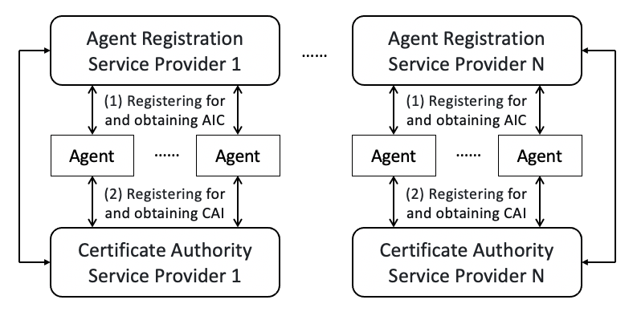
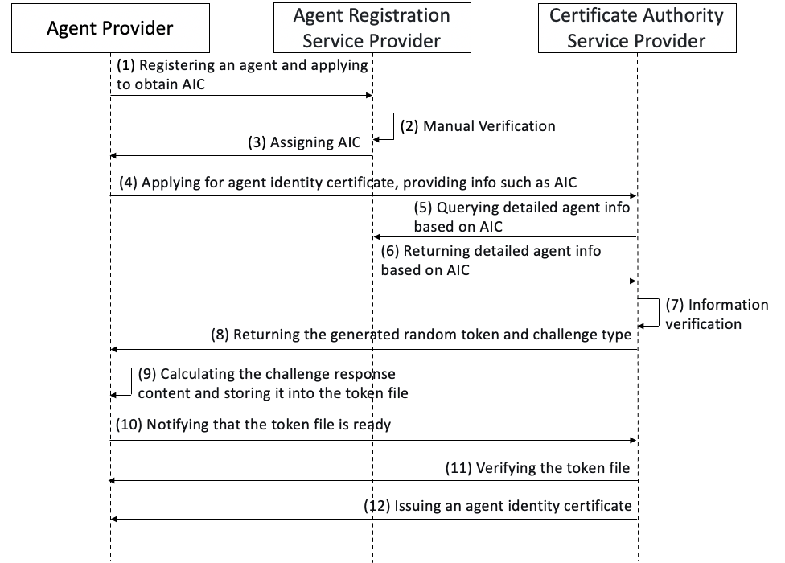
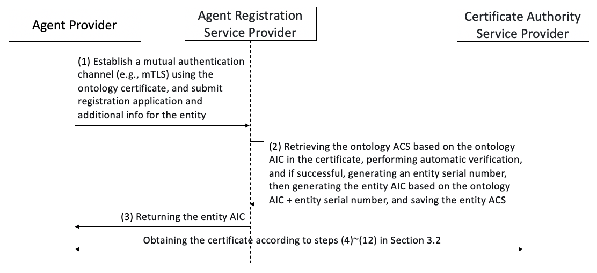

[Home](../README_en.md)

**[English](ACPs-spec-ATR_en.md) | [中文](ACPs-spec-ATR.md)**

ATR: Agent Trusted Registration (ACPs-spec-ATR-v02.02)

# 1. Document Definition

This document is the definition of the Agent Trusted Registration (ATR) process in the ACPs agent collaboration protocol suite, version v02.02.

The full title of the document is ACPs-spec-ATR-v02.02.

Document authors: Jun Liu (Beijing University of Posts and Telecommunications), Haozhe Song (Beijing University of Posts and Telecommunications), Yinming Li (Beijing University of Posts and Telecommunications), Ke Li (Beijing University of Posts and Telecommunications), Ke Yu (Beijing University of Posts and Telecommunications), Xiaofeng Hu (Beijing University of Posts and Telecommunications), Di Ma (Beijing University of Posts and Telecommunications), Keliang Chen (Beijing University of Posts and Telecommunications), Ge Gao (China Electronics Standardization Institute).

# 2. Introduction to the Agent Registration Process

For agent interconnection to become a secure and reliable agent system, the agents running within it with the ability to execute tasks autonomously should be secure and reliable entities. To achieve this goal, each agent should satisfy the following two necessary conditions:

(1) Obtain a globally unique identity identifier from an agent registration service provider; this identifier is the Agent Identity Code (AIC, see the AIC standard definition document in the ACPs protocol suite);

(2) Obtain a digital certificate usable for identity verification, called the Certificate of Agent Identity (CAI), from the certificate authority service provider designated by the agent registration service provider.

An agent registration process that satisfies the above two conditions can be called an agent trusted registration process.

As already defined in the AIC standard definition document of the ACPs protocol suite, each agent should have a unique AIC, which comes from the agent registration service provider (ARSP) with which the agent first registers. In agent interconnection, there may be multiple agent registration service providers, and each provider should be a service entity that has been recognized by consensus (for example, certified by a management authority). Each agent can choose a different agent registration service provider (ARSP) to register with according to its own needs, and obtain the assigned AIC.

After obtaining an AIC, an agent also needs to obtain an agent identity certificate from a certificate authority service provider (CASP). In agent interconnection, there may be multiple certificate authority service providers, and each provider should be a service entity that has been recognized by consensus (for example, certified by a management authority). The complete trusted registration process is shown in the figure below.

# 3. Definition of the Agent Trusted Registration Process

## 3.1 Explanation of the Agent Ontology and Entity Concepts

In the ATR system, an agent's AIC comes in two types: the **ontology AIC** and the **entity AIC**:

- **Ontology**: Similar to a Class definition in programming, it represents the abstract definition and capability specification of an agent. The Level 8 agent entity serial number of an ontology AIC is 0.
- **Entity**: Similar to a runtime Instance, it represents an actually running agent service instance. An entity AIC is also a complete AIC, whose Level 8 agent entity serial number part is a non-zero value, used to distinguish different entities under the same ontology.

According to the AIC specification (ACPs-spec-AIC), the entity serial number occupies 9 digits (Level 8 of the OID) and uses base-36 encoding. Each ontology can register at most about **101.5 trillion** (36^9 ≈ 1.01 × 10^14) entities.

## 3.2 Agent Ontology Registration Process

The detailed process of agent ontology trusted registration is shown in the figure below. For scenarios that require only a single agent, the agent provider can perform integrated ontology and entity registration through the following process and apply for a certificate directly for that entity's AIC; for cases where multiple entities need to be started for the same agent, the provider must separately register its agent ontology according to the following process, and then perform entity registration through the agent entity registration process in 3.3.

The steps shown in the figure are as follows:

(1) The agent provider sends a registration request to the agent registration service provider to register the agent; the request must contain ACS information and applies to obtain an AIC;

(2) The agent registration service provider manually reviews the content of the registration request;

(3) After the review passes, the agent registration service provider assigns an AIC to the agent;

(4) If the agent provider is applying for a certificate from the certificate authority service provider (running the CA Server) for the first time, it must first apply to the agent registration service provider for an EAB (External Account Binding) credential, and then use the CA Client tool to register an ACME account with the CA Server (carrying the EAB credential at registration, thereby binding the ACME account to the AIC). It then uses the CA Client tool to apply to the CA Server for the agent identity certificate; the request must include the AIC and the intended use of the certificate (clientAuth or serverAuth);

(5) Based on the agent's AIC, the CA Server requests the agent's detailed information from the agent registration service provider;

(6) The agent registration service provider returns the agent's detailed information to the CA Server according to the AIC. The returned detailed information must include the AIC, provider information, and the agent ACS (including certificate-related configuration such as `certificate.altNames` and `certificate.requestedValidity`);

(7) The CA Server checks the agent's detailed information;

(8) After the information check passes, the CA Server verifies the EAB (External Account Binding) credential carried when the ACME account was registered, confirming that the ACME account has been bound to the corresponding AIC (the EAB credential was applied for by the agent provider from the agent registration service provider in step (4));

(9) After EAB verification passes, the CA Server creates an ACME Order for the agent AIC; the CA Server reads `certificate.altNames` (custom SAN configuration) and `certificate.requestedValidity` (requested validity period, in days) from the ACS obtained in step (6);

(10) The CA Server creates an Authorization object for the identifier in the Order; because the EAB credential already completed AIC ownership verification when the ACME account was registered, the Authorization is directly marked as valid and no HTTP-01 challenge verification step is required;

(11) After the Order status becomes `ready`, the CA Client generates a key pair and a CSR and submits them to the CA Server, and the CA Server issues the certificate according to the CSR and the ACS information;

(12) The CA Server constructs the certificate according to the agent's detailed information: **CN** uses the AIC (with no domain suffix appended); **SubjectAlternativeName** contains the `URI:acps://{AIC}` protocol identifier as well as the DNS/IP SANs declared in `certificate.altNames` of the ACS; **extendedKeyUsage** is issued separately according to the requested use (a clientAuth certificate contains only `clientAuth`, and a serverAuth certificate contains only `serverAuth`; the two uses must be applied for separately); the **validity period** uses the number of days specified by `certificate.requestedValidity` (if it exceeds the upper limit, it is issued at the upper limit). Finally, the agent provider initiates a certificate download request to the CA Server to obtain the final agent identity certificate.

The certificate Subject `CN` **MUST** use the AIC. If the certificate contains a `SubjectAlternativeName` `URI:acps://{AIC}`, that SAN AIC **MUST** be consistent with the AIC in the Subject `CN`. When both are present but inconsistent, the verifier **MUST** determine that the certificate identity is invalid.

## 3.3 Agent Entity Trusted Registration Process

The detailed process of agent entity trusted registration is shown in the figure below.

(1) The agent provider uses the agent ontology certificate obtained in 3.2 to establish a mutual authentication channel (such as mTLS) with the agent registration service provider, and submits an entity registration application; the request contains the ontology AIC and additional information (such as location).

(2) Based on the AIC in the agent ontology certificate, the agent registration service provider retrieves the ontology's ACS and verifies it automatically; if successful, it generates an entity serial number, then generates the entity AIC from the ontology AIC plus the entity serial number, and finally saves the entity's ACS.

(3) The agent registration service provider returns the AIC of the newly registered agent entity to the agent provider.

(4) After obtaining the AIC, the agent provider obtains the certificate by following steps (4)–(12) in 3.2.

# 4. Supplementary Notes

The agent trusted registration process defined in this document fully takes manageability and compatibility into consideration and is provided free of charge to relevant developers and institutions for reference. We welcome other industry colleagues engaged in agent development and the formulation of agent interconnection protocols to support and adopt this process definition, so as to form an agent registration service that favors interconnection and good compatibility.
